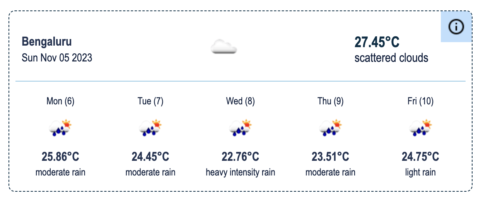
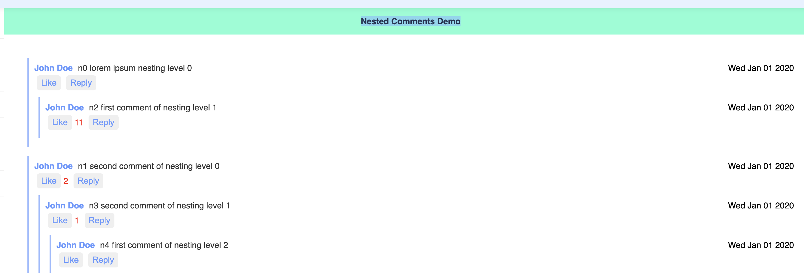
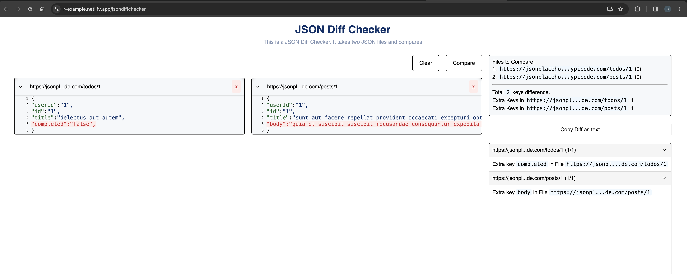

# UI Machine coding challenges built with React

## 

# Samples

| Projects                                                                                                                                                                                                                                                                                                                                                                                                                                                                     |                                                                                                                       |
| :--------------------------------------------------------------------------------------------------------------------------------------------------------------------------------------------------------------------------------------------------------------------------------------------------------------------------------------------------------------------------------------------------------------------------------------------------------------------------- | --------------------------------------------------------------------------------------------------------------------: |
| <h3>Weather Widget </h3> 
A minimal UI to displays weekly weather based on location. Lat and Long can be provided in url.
   **[> Browse](./src/Projects/Weather#readme)** **> Demo: [Live](https://r-example.netlify.app/weather?lat=12.9634&lon=77.5855&city=Bengaluru)**                                                                                                                                                                                    |                                                  |
| <h3>Bishop's Chessboard </h3> 
Frontend Machine Coding challenge
   **[> Browse](./src/Projects/chessboard#readme)** **> Demo: [Live](https://r-example.netlify.app/chessboard) \| [Question](https://workat.tech/frontend-development/practice/chessboard-showing-bishop-moves-21fq78tswbst)**                                                                                                                                                                |  |
| <h3>Nested Comments </h3> 
 - The user can add comments directly.  - The user can add a reply to any comment.   - The user can add a reply to any comment which is a reply.   - The user can like any comment at any level.
   **[> Browse](./src/Projects/nested-comments#readme)** **> Demo: [Live](https://r-example.netlify.app/nested-comments) \| [Question](https://workat.tech/frontend-development/practice/nested-comments-dw58rtamjfe9t)** |               |
| <h3>JSON API response Compare </h3> 
Compares the API response or any json file.   It only check the API contract, Keys, and structure of the two json objects.
   **[> Browse](./src/Projects/jsonDiffChecker#readme)** **> Demo: [Live](https://r-example.netlify.app/jsondiffchecker)**                                                                                                                                                                  |              |
