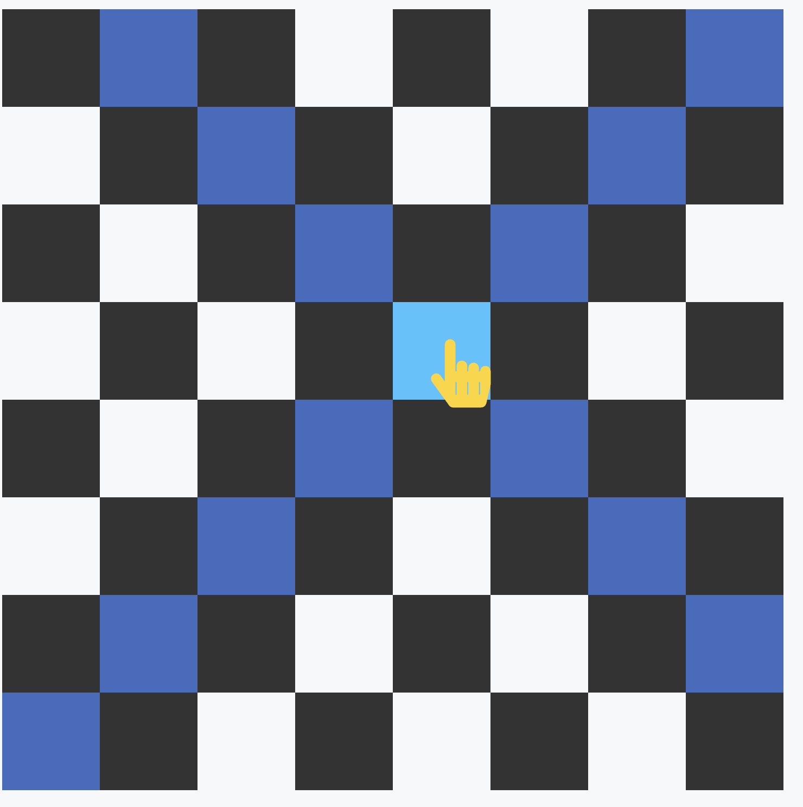

# Bishop on Chessboard - Frontend Machine Coding | HTML, CSS, JS

  

Create a chess board which highlights the squares being attacked by a bishop.
Display a chessboard on your webpage. Below is an example of what a chessboard looks like.

When the user hovers on any square of the chessboard:

Change the color of the square to light blue.
Change the color of the squares that would be attacked by a bishop to dark blue. A bishop attacks along its diagonals.

**> Demo: [Live](https://r-example.netlify.app/chessboard) \| [Question](https://workat.tech/frontend-development/practice/chessboard-showing-bishop-moves-21fq78tswbst)**
