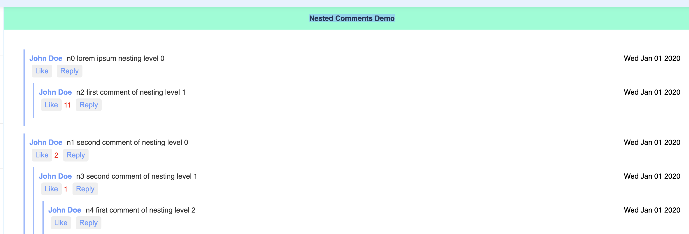

# Nested Comments

Build a comments section which has the following properties:

- The user can add comments directly.
- The user can add a reply to any comment.
- The user can add a reply to any comment which is a reply.
- The user can like any comment at any level.

**> Demo: [Live](https://r-example.netlify.app/nested-comments) \| [Question](https://workat.tech/frontend-development/practice/nested-comments-dw58rtamjfe9t)**

---

